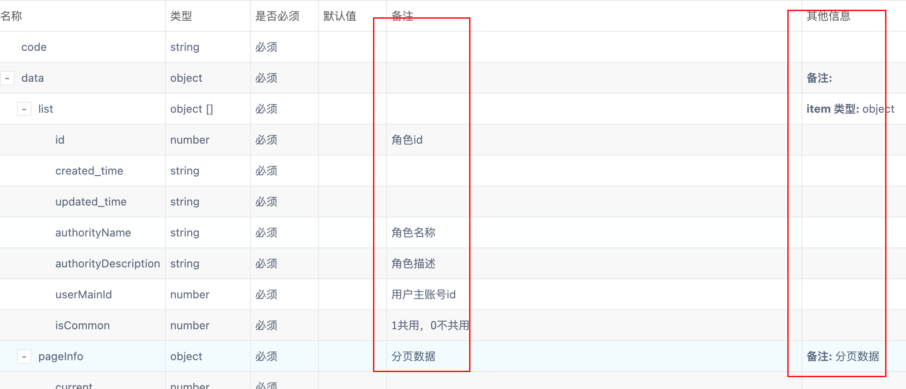
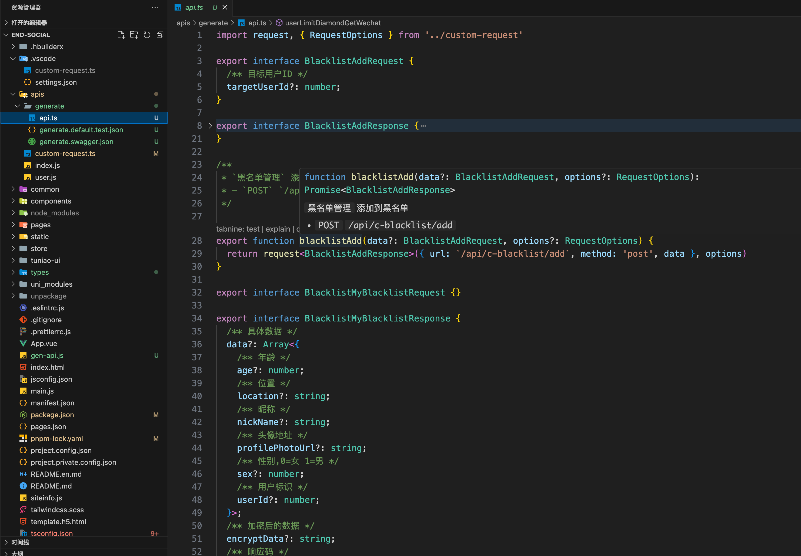
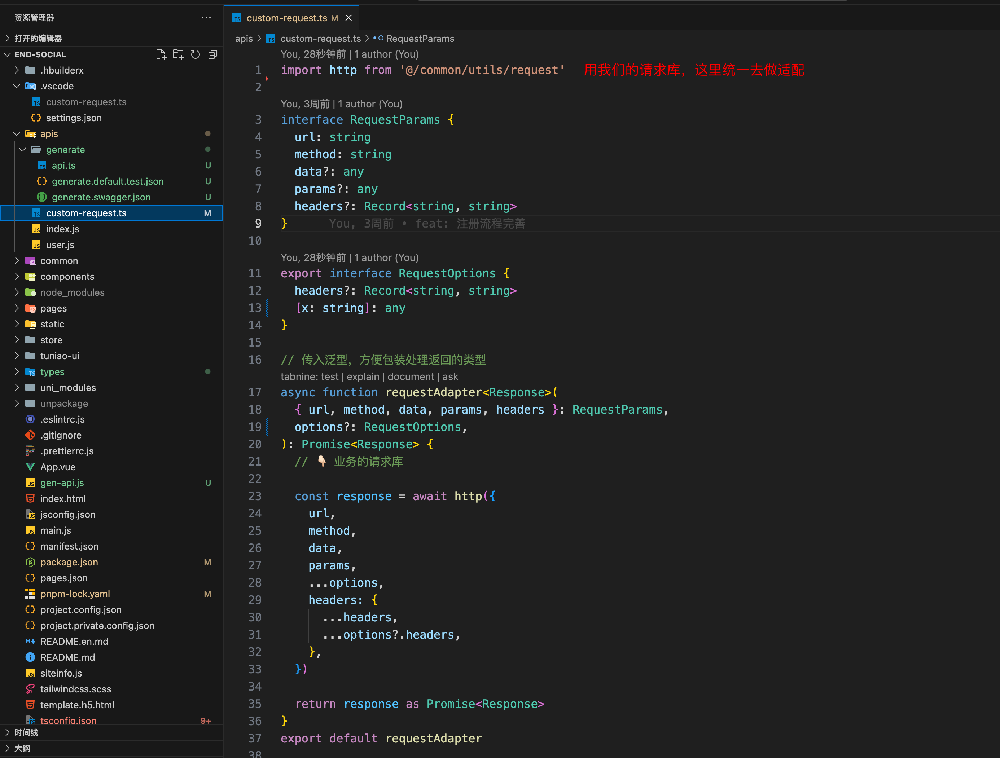
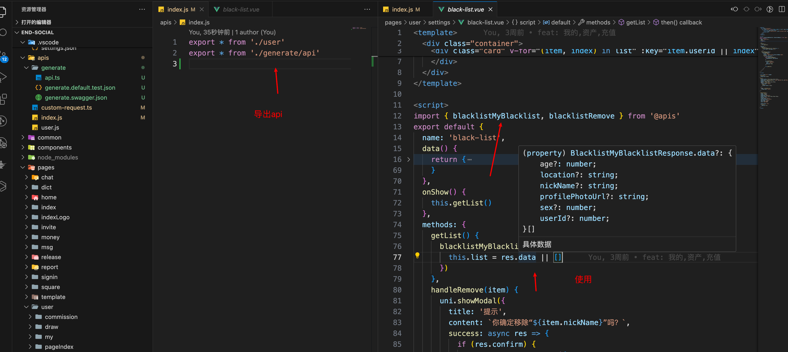
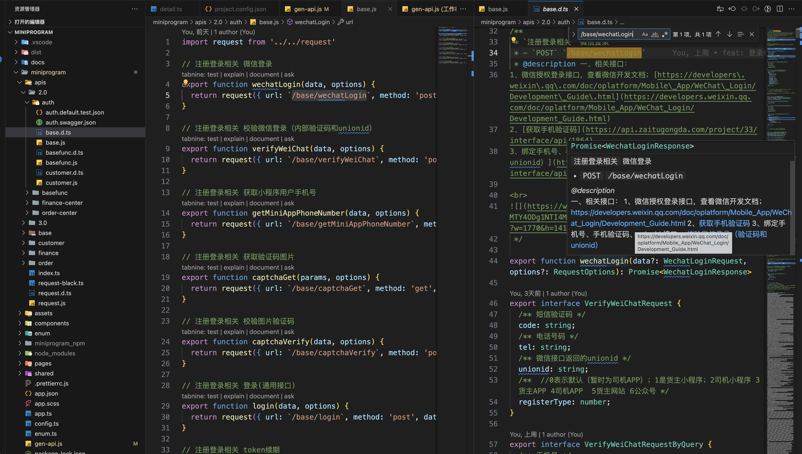

# swagger-gen-ts

swagger 转 ts 类型

> 目前只支持 swagger 2.x

## 安装

```base
npm install swagger-gen-ts
```

## 前言

### 为什么写这个工具？

我在网上找了所有的 swagger.json 生成 typescript 的，我都下载下来过尝试了，发现各种问题

- 生成的 api 函数名是未知的： 一般有的是按照 swagger.json 的 operationId，而我们的文档都是后端给的，一般接口随意变化的，你根本就不知道 operationId 是什么，并且还不语义化，有的是按照 URL 和随机生成的
- 生成的文件文件夹不稳定：找了几个，发现有的是用 swagger.json 的 tag 来生成，我的哥，tag 是很容易变化的好吧，还是中文命名，一变化就出错了
- 所有的都不支持 remark 的备注提示，这个一个都没有、下面的有备注和其他信息，但发现生成出来的注释，只有其他信息，没有备注；这个我是看了网上所有的，都发现没有这个备注，所以就决定重写了，因为我们这个文档的都是备注栏里面的
  
- 生成的 api 函数，连基本的 config 都不能支持，生成的差不多都是下面这个格式

  ```
  function getUserDetail(params: UserRequest) {
    // ....
  }
  ```

  这样就只能 getUserDetail({id: 'xx'}) 这样调用，我们想要其他的配置没有
  还有可能函数体是写死的

- 配置复杂：大多数你想要自定义，配置超级复杂，还需要自己去写模板；在小公司的话就要快准狠，根本就没有那么多时间去弄，还可能出问题，还写了半天发现根本和自己想的不一样，费了很多时间
- 不支持 ts，好多都是弄成什么配置文件 xxx.config.js，两个提示都没有，每次还得去看文档，很痛苦

### 这个工具优势

没啥优势，就一个很轻量的 swagger 转 ts，正常的使用，不能自定义太多

- 我们都知道 url 基本上不会变化的，所以默认的生函数名和文件夹名都是基于 url 来生成的，就比较稳定
- 添加了默认值，比如表单后端要求你必须一个个的字段传递，一个不能多，一个不能少，
  `swagger-gen-ts`生成了 一个 `${xxxx}.test.json` 文件，里面有请求和响应的默认值信息，如下内容

  ```json
  {
    "/order-center/sender/order/toPlatform Request": [
      {
        "isDesignative": 0,
        "orderToPlatformDTO": {
          "quotedPrice": 0,
          "invoiceType": 0,
          "taxation": 0,
          "priceWithTax": 0,
          "contactor": "",
          "contactorNo": "",
          "platformRemark": "",
          "isShare": 0,
          "matchDeadlineTime": "",
          "dispatch": {
            "dispatchMotorcadeId": 0,
            "vehicleId": 0,
            "driverId": 0,
            "userId": 0
          }
        },
        "orderType": 0,
        "orderNo": "",
        "arrivingFactoryTime": "",
        "businessNo": "",
        "nettWeight": 0,
        "containerNo": ""
      }
    ],
    "/order-center/sender/order/toPlatform Response": {
      "code": "",
      "msg": "",
      "data": null
    }
  }
  ```

  这个内容有什么用呢？你在 vue 中可以直接拷贝这些字段，就不用一个个的写了，减少时间，也不用不用担心少写 key，还有如果 key 比较多的时候，我遇到表单有四五十个 key 的，那么这样比较多，
  这样也可以直接拷贝，一个个的复制，或者通过 Object.keys({}) 这样拿到所有的 key，就减少时间减少错误可以方便做很多操作；刚好看见是 0 的，也知道是 Number 类型，我们在提交的时候要转换下处理

## 基本使用

在中新建一个 js 文件，名字自定义，例如 `gen-api.ts`

```js
const { swaggerToTs } = require('swagger-gen-ts')

swaggerToTs({
  source: 'http://www.weyqu.com/api/v2/api-docs',
  output: './apis/generate',
  requestFilePath: './apis/custom-request',
  maxFolderDepth: 1,

  lang: 'ts',
  // 生成api函数名的时候，url 替换
  // /api/c-user-limit/diamond-get-wechat => /api/user-limit/diamond-get-wechat
  // 这样生成的函数名就是 userLimitDiamondGetWechat
  generateNameUrlReplace: url => url.replace('/c-', '/'),
})
```

执行输出

```base
node ./gen-api.js
```

**生成如下**


**自定义请求文件**


**结合实际的业务编写 custom-request**

- `data` 是 提交的 body 部分数据
- `params` 是 url 上的数据
- `post` 请求可能也会有 `params` 的
  

**页面使用**


### 生成 JS

```js
const { swaggerToTs } = require('swagger-gen-ts')

swaggerToTs({
  output: './apis',
  maxFolderDepth: 1,
  clean: true,
  lang: 'js',
  requestFilePath: './apis/request',
  exclude: ['/?', '/a', '/bi'],
  group: [
    {
      output: '2.0/finance-center',
      // yapi 的 SwaggerJson 链接
      source:
        'https://api.zaitugongda.com/api/plugin/exportSwagger?type=OpenAPIV2&pid=70&status=all&isWiki=false&token=50e6d5dca36cc27a84d7e9fa84f33cdfb08018a29106ec7918f6d8eeba61a857',
    },
    {
      output: '2.0/basefunc',
      source:
        'https://api.zaitugongda.com/api/plugin/exportSwagger?type=OpenAPIV2&pid=62&status=all&isWiki=false&token=20459cba45138a0b84cd989aa3fb61312e56edc8e37ea677e869b9cfb8038bf2',
    },
    {
      output: '2.0/order-center',
      source:
        'https://api.zaitugongda.com/api/plugin/exportSwagger?type=OpenAPIV2&pid=67&status=all&isWiki=false&token=fae8db9cd092f28bc905a630a77c8b7de2fb90970f76d9a4c255e01b81fe257a',
    },
    {
      output: '2.0/auth',
      source:
        'https://api.zaitugongda.com/api/plugin/exportSwagger?type=OpenAPIV2&pid=5283&status=all&isWiki=false&token=2925d424f041867e8401e742dccaed56bd7e3c0014a82bd897161d5e330ec584',
    },
    {
      output: '3.0',
      group: [
        {
          output: 'order-center',
          source:
            'https://api.zaitugongda.com/api/plugin/exportSwagger?type=OpenAPIV2&pid=520&status=all&isWiki=false&token=5806f9230cd1129ead1f795c38fec80cbab7f1df7d9fde84d95ca94a109faa30',
        },
      ],
    },
  ],
})
```

生成的结果如下


## 默认配置

```ts
const defaultUserConfig = {
  source: '', // url 或者 json，本地path
  output: './src/apis', // 输出目录
  lang: 'ts', // 输出模板、ts | js
  include: [], // 包含哪些接口
  exclude: [], // 排除哪些接口
  requestFilePath: './src/request',

  indent: '\t', // 缩进
  clean: false, // 是否清空目录

  // 👇🏻 生成配置，通过下面这几个，影响默认的 generateFilePath 和 generateFilePath 的生成
  maxFolderDepth: 1, // 生成的文件目录层级最多少层
  apiFunctionContainFileName: false, // 生成的api函数名包含文件名
  apiFunctionNameMaxDepth: 5, // 函数名最大深度、默认生成的函数名是通过url来生成的，那么URL很长时截取多少位的合理值
  generateNameUrlReplace: url => url, // 生成函数替换的url

  // 👇🏻 generateFilePath | generateApiName 可以根据特殊情况来更改，但不建议
  // 生成的文件目录
  // ${outDir}目录到文件的路径，不含文件后缀名  a/b => `${outDir}/a/b`
  generateFilePath(url, options) {
    // 处理路径参数 `/pet/{id}` => `/pet/${id}`
    url = url.replace(/{(.*?)}/g, '$1')
    const names = options.config.generateNameUrlReplace(url).split('/').filter(Boolean)
    // 最后一级不要
    if (names.length > 1) {
      names.pop()
    }
    return names.slice(0, options.maxFolderDepth).join('/')
  },
  // 生成的文件名
  generateApiName(url, options) {
    // 处理路径参数 `/pet/{id}` => `/pet/${id}`
    url = url.replace(/{(.*?)}/g, '$1')

    const { apiFunctionContainFileName, apiFunctionNameMaxDepth } = options.config
    const urlNames = options.config.generateNameUrlReplace(url).split('/').filter(Boolean)
    const urlLength = urlNames.length
    const maxFolderDepth =
      options.maxFolderDepth <= 0 && !options.config.apiFunctionContainFileName ? 1 : options.maxFolderDepth
    const minApiNameLevel = apiFunctionContainFileName ? 2 : 1

    let apiNameLength = urlLength + (apiFunctionContainFileName ? 1 : 0) - maxFolderDepth
    if (apiNameLength < minApiNameLevel) {
      apiNameLength = minApiNameLevel
    } else if (apiNameLength > apiFunctionNameMaxDepth) {
      apiNameLength = apiFunctionNameMaxDepth
    }
    // 要截多少位
    const apiNames = urlNames.slice(0 - apiNameLength)

    const suffix = options.isRepeatUrl ? toUpperCaseCamelCase(options.method) : ''

    return snakeToCamel(apiNames.join('-')) + suffix
  },
}
```

## API

```ts
function swaggerToTs(config: UserConfig): Promise<void>
```

```ts
import { OpenAPIV2 } from 'openapi-types'

export type Schema = OpenAPIV2.Schema
export type Parameter = OpenAPIV2.Parameter
export type ParameterBody = OpenAPIV2.InBodyParameterObject
export type ParameterObject = OpenAPIV2.GeneralParameterObject
export type SchemaObject = OpenAPIV2.SchemaObject
export type Response = OpenAPIV2.Response

export type SwaggerJson = OpenAPIV2.Document

export type OperationObject = OpenAPIV2.OperationObject

export type ApiRegExp = RegExp | string | ((url: string) => string)

export type Method = 'get' | 'post' | 'put' | 'patch' | 'delete'

/**
 * 解析结果
 */
export interface ParseResult {
  /**
   * url，是 baseURL + path
   */
  url: string
  method: Method
  /**
   * 是否是重复的URL，url相同method不同的情况
   */
  isRepeatUrl: boolean

  path: string
  basePath?: string

  swaggerJson: SwaggerJson
  methodConfig: OperationObject
  /**
   * 用户的生成配置
   */
  config: GenerateConfig
  maxFolderDepth: number

  title: string
  description?: string
  tags: string[]
  tagName: string
}

export interface ParseResultFull extends ParseResult {
  filePath: string
  apiFunctionName: string

  requestTypeName: string
  responseTypeName: string

  requestQueryTypeName?: string
}

export interface UserGroupConfig extends BaseUserConfig {
  /**
   * 组，group 里面的配置会继承于当前配置和上一级的配置
   */
  group: UserConfig[]
}

export interface SourceConfig extends BaseUserConfig {
  /**
   * url 或者 json，本地path
   */
  source: string
}

export interface BaseUserConfig {
  /**
   * 输出目录
   * @default './services'
   */
  output?: string

  /**
   * 请求文件的路径
   * @default "./request"
   * @example "./request"
   */
  requestFilePath?: string

  /**
   * 输出模板
   * @default 'ts'
   */
  lang?: 'js' | 'ts'
  /**
   * 包含哪些接口
   */
  include?: ApiRegExp[]
  /**
   * 排除哪些接口
   */
  exclude: ApiRegExp[]

  /**
   * 缩进
   * @default "\t"
   */
  indent?: string

  /**
   * 是否清空目录
   * @default false
   */
  clean?: boolean

  /**
   * 最大生成文件层级
   * @default 1
   */
  maxFolderDepth?: number
  // /**
  //  * TODO：
  //  * 更改URL来生成api的级别
  //  * @description
  //  * 比如/api/system/user/detail
  //  * 传2生成的函数名为 userDetail
  //  * 传3生成的函数名为 systemUserDetail
  //  * @default 2
  //  */
  // urlToApiNameLevel?: number;

  /**
   * 生成的api函数名包含文件名
   * @default true
   */
  apiFunctionContainFileName?: boolean
  /**
   * 函数名最大深度
   * 默认生成的函数名是通过url来生成的，那么URL很长时截取多少位的合理值
   * @default 5
   */
  apiFunctionNameMaxDepth?: number

  /**
   * 生成函数名的时候替换URL
   * 生成api函数名的时候，url 替换
   * @example
   *  generateNameUrlReplace: url => url.replace('/c-', '/')
   * /api/c-user-limit/diamond-get-wechat => /api/user-limit/diamond-get-wechat
   * 这样生成的函数名就是 userLimitDiamondGetWechat
   */
  generateNameUrlReplace?: (url: string) => string

  /**
   * 生成的文件路径
   * @description ${outDir}目录到文件的路径，不含文件后缀名  a/b => `${outDir}/a/b`
   */
  generateFilePath?: (url: string, options: ParseResult) => string

  /**
   * 生成的函数名
   */
  generateApiName?: (url: string, options: ParseResult) => string
}

/**
 * 用户的配置
 */
export type UserConfig = UserGroupConfig | SourceConfig

export type GenerateConfig = Required<UserConfig>
```
